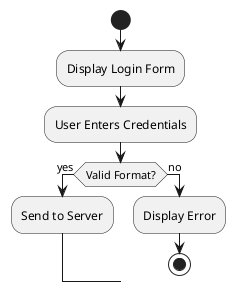

# E-Commerce System - Activity Diagrams

## Table of Contents
1. [User Registration](#1-user-registration)
2. [User Login with First-Time Password Activation](#2-user-login-with-first-time-password-activation)
3. [Product Browsing and Filtering](#3-product-browsing-and-filtering)
4. [Add Product to Cart](#4-add-product-to-cart)
5. [Order Placement with OTP Verification](#5-order-placement-with-otp-verification)
6. [Order Status Update (Admin)](#6-order-status-update-admin)
7. [Inventory Update on Order Completion](#7-inventory-update-on-order-completion)
8. [Customer Account Creation by Admin](#8-customer-account-creation-by-admin)
9. [Reorder Previous Order](#9-reorder-previous-order)
10. [Low Stock Alert Generation](#10-low-stock-alert-generation)

---

## 1. User Registration

### Description
This diagram shows the complete user registration process from the customer's perspective, including client-side validation and server-side account creation.

### Activity Diagram

**Client Side:**
```
[Start] → [Display Registration Form] → [User Enters Information]
→ [Client-Side Validation] → [Decision: Valid Format?]
  ├─[No] → [Display Validation Errors] → [Return to Form]
  └─[Yes] → [Send Registration Data to Server] → [Show Loading Indicator]
    → [Wait for Server Response] → [Receive Response]
    → [Decision: Registration Successful?]
      ├─[No] → [Display Error Message] → [Return to Form]
      └─[Yes] → [Display Success Message] → [Redirect to Login] → [End]
```

**Server Side:**
```
[Receive Registration Request] → [Validate Phone Number Format]
→ [Check if Phone Already Exists] → [Decision: Phone Exists?]
  ├─[Yes] → [Return Error: Phone Already Registered] → [End]
  └─[No] → [Validate Email (if provided)] → [Hash Password]
    → [Create Customer Account] → [Set Status: Active]
    → [Send Welcome SMS] → [Return Success Response] → [End]
```

### Key Activities:
- Client-side input validation
- Server-side duplicate checking
- Password hashing
- Account creation
- Welcome notification

---

## 2. User Login with First-Time Password Activation

### Description
This diagram shows the login process, including the special case where an admin-created account requires password activation on first login.

### Activity Diagram

**Client Side:**
```
[Start] → [Display Login Form] → [User Enters Phone & Password]
→ [Send Credentials to Server] → [Wait for Response]
→ [Receive Response] → [Decision: Login Successful?]
  ├─[No] → [Display Error Message] → [Return to Login Form]
  └─[Yes] → [Decision: First Login & Admin Created?]
      ├─[Yes] → [Display Password Change Form] → [User Enters New Password]
        → [Send New Password to Server] → [Wait for Response]
        → [Decision: Password Changed?]
          ├─[No] → [Display Error] → [Return to Password Change]
          └─[Yes] → [Store Session Token] → [Redirect to Dashboard] → [End]
      └─[No] → [Store Session Token] → [Redirect to Dashboard] → [End]
```

**Server Side:**
```
[Receive Login Request] → [Validate Input] → [Find Customer by Phone]
→ [Decision: Customer Exists?]
  ├─[No] → [Return Error: Invalid Credentials] → [End]
  └─[Yes] → [Verify Password] → [Decision: Password Correct?]
      ├─[No] → [Return Error: Invalid Credentials] → [End]
      └─[Yes] → [Check if First Login & Admin Created]
          → [Decision: Requires Password Change?]
            ├─[Yes] → [Return Flag: Password Change Required] → [End]
            └─[No] → [Generate Session Token] → [Create Session]
              → [Return Success with Token] → [End]

[Receive Password Change Request] → [Validate New Password]
→ [Check Password Requirements] → [Decision: Meets Requirements?]
  ├─[No] → [Return Error: Weak Password] → [End]
  └─[Yes] → [Hash New Password] → [Update Customer Password]
    → [Mark Password as Changed] → [Generate Session Token]
    → [Return Success] → [End]
```

### Key Activities:
- Credential validation
- First-time login detection
- Mandatory password change
- Session management

---

## 3. Product Browsing and Filtering

### Description
This diagram shows how customers browse products with advanced filtering capabilities.

### Activity Diagram

**Client Side:**
```
[Start] → [Display Product List] → [User Applies Filters]
→ [Decision: Filter Applied?]
  ├─[Yes] → [Update Filter Parameters] → [Send Filter Request to Server]
  └─[No] → [User Selects Sort Option] → [Send Sort Request to Server]
    → [Wait for Response] → [Receive Filtered/Sorted Products]
    → [Display Products] → [Decision: User Clicks Product?]
      ├─[Yes] → [Navigate to Product Details] → [End]
      └─[No] → [Decision: Apply More Filters?]
          ├─[Yes] → [User Applies Filters]
          └─[No] → [End]
```

**Server Side:**
```
[Receive Product Request] → [Extract Filter Parameters]
→ [Apply Category Filter] → [Apply Brand Filter]
→ [Apply Price Range Filter] → [Apply Rating Filter]
→ [Apply Availability Filter] → [Execute Database Query]
→ [Apply Sorting] → [Paginate Results] → [Return Product List] → [End]
```

### Filter Types:
- Price range (min/max)
- Category
- Brand
- Customer rating
- Availability status
- Sorting options

---

## 4. Add Product to Cart

### Description
This diagram shows the process of adding a product to the shopping cart, including availability checking and variation selection.

### Activity Diagram

**Client Side:**
```
[Start] → [User Views Product Details] → [User Selects Variation (if applicable)]
→ [User Enters Quantity] → [User Clicks Add to Cart]
→ [Decision: User Authenticated?]
  ├─[No] → [Display Login Prompt] → [Redirect to Login] → [End]
  └─[Yes] → [Send Add to Cart Request] → [Show Loading Indicator]
    → [Wait for Response] → [Receive Response]
    → [Decision: Success?]
      ├─[No] → [Display Error Message] → [End]
      └─[Yes] → [Update Cart Icon Count] → [Display Success Message]
        → [Decision: Continue Shopping?]
          ├─[Yes] → [Return to Product List] → [End]
          └─[No] → [Navigate to Cart] → [End]
```

**Server Side:**
```
[Receive Add to Cart Request] → [Validate User Session]
→ [Decision: Valid Session?]
  ├─[No] → [Return Error: Unauthorized] → [End]
  └─[Yes] → [Validate Product ID] → [Check Product Exists]
    → [Decision: Product Exists?]
      ├─[No] → [Return Error: Product Not Found] → [End]
      └─[Yes] → [Check Variation Availability (if applicable)]
        → [Decision: Variation Available?]
          ├─[No] → [Return Error: Variation Not Available] → [End]
          └─[Yes] → [Check Current Inventory] → [Decision: Sufficient Stock?]
              ├─[No] → [Return Error: Insufficient Stock] → [End]
              └─[Yes] → [Check if Item Already in Cart]
                  → [Decision: Item Exists in Cart?]
                    ├─[Yes] → [Update Quantity] → [Recalculate Subtotal]
                    └─[No] → [Add New Item to Cart] → [Calculate Subtotal]
                      → [Save Cart] → [Return Success] → [End]
```

### Key Activities:
- Authentication check
- Product and variation validation
- Inventory availability check
- Cart persistence
- Quantity management

---

## 5. Order Placement with OTP Verification

### Description
This comprehensive diagram shows the complete order placement process including cart review, address confirmation, OTP generation, verification, and order creation.

### Activity Diagram

**Client Side:**
```
[Start] → [User Views Cart] → [User Clicks Checkout]
→ [Display Order Summary] → [User Reviews Items]
→ [User Confirms Delivery Address] → [System Auto-Detects Province]
→ [User Can Override Province] → [Display Delivery Fee]
→ [User Clicks Place Order] → [Send Order Request to Server]
→ [Wait for OTP] → [Receive OTP Notification]
→ [Display OTP Input Form] → [User Enters OTP]
→ [Send OTP to Server] → [Wait for Verification]
→ [Receive Response] → [Decision: OTP Valid?]
  ├─[No] → [Display Error: Invalid OTP] → [Decision: Retry?]
    ├─[Yes] → [User Enters OTP]
    └─[No] → [Cancel Order] → [End]
  └─[Yes] → [Display Order Confirmation] → [Clear Cart]
    → [Show Order Number] → [End]
```

**Server Side:**
```
[Receive Order Request] → [Validate User Session]
→ [Validate Cart Contents] → [Check All Items Still Available]
→ [Decision: All Items Available?]
  ├─[No] → [Return Error: Items Unavailable] → [End]
  └─[Yes] → [Calculate Subtotal] → [Get Province Delivery Fee]
    → [Calculate Total Amount] → [Generate OTP]
    → [Store OTP with Expiration] → [Send OTP via SMS/WhatsApp]
    → [Return OTP Sent Confirmation] → [Wait for OTP Verification]

[Receive OTP Verification] → [Validate OTP Format]
→ [Check OTP Exists] → [Decision: OTP Exists?]
  ├─[No] → [Return Error: Invalid OTP] → [End]
  └─[Yes] → [Check OTP Expiration] → [Decision: OTP Expired?]
      ├─[Yes] → [Return Error: OTP Expired] → [End]
      └─[No] → [Verify OTP Match] → [Decision: OTP Matches?]
          ├─[No] → [Return Error: Invalid OTP] → [End]
          └─[Yes] → [Mark OTP as Used] → [Create Order Record]
            → [Create Order Items] → [Set Status: Pending]
            → [Reserve Inventory] → [Send Order Confirmation SMS]
            → [Return Order Success] → [End]
```

### Key Activities:
- Cart validation
- Inventory re-checking
- OTP generation and expiration
- OTP verification
- Order creation
- Inventory reservation

---

## 6. Order Status Update (Admin)

### Description
This diagram shows how administrators update order status through the workflow, with restrictions on completed and cancelled orders.

### Activity Diagram

**Client Side (Admin Panel):**
```
[Start] → [Admin Views Order List] → [Admin Selects Order]
→ [Display Order Details] → [Admin Views Current Status]
→ [Admin Selects New Status] → [Send Status Update Request]
→ [Wait for Response] → [Receive Response]
→ [Decision: Update Successful?]
  ├─[No] → [Display Error Message] → [End]
  └─[Yes] → [Update Order Display] → [Show Success Message]
    → [Decision: Update Another Order?]
      ├─[Yes] → [Admin Selects Order]
      └─[No] → [End]
```

**Server Side:**
```
[Receive Status Update Request] → [Validate Admin Session]
→ [Check Admin Permissions] → [Decision: Has Permission?]
  ├─[No] → [Return Error: Unauthorized] → [End]
  └─[Yes] → [Validate Order ID] → [Retrieve Order]
    → [Decision: Order Exists?]
      ├─[No] → [Return Error: Order Not Found] → [End]
      └─[Yes] → [Check Current Status] → [Decision: Completed or Cancelled?]
          ├─[Yes] → [Return Error: Cannot Modify Completed/Cancelled Order] → [End]
          └─[No] → [Validate Status Transition] → [Decision: Valid Transition?]
              ├─[No] → [Return Error: Invalid Status Transition] → [End]
              └─[Yes] → [Update Order Status] → [Log Status Change]
                → [Decision: Status = Delivered?]
                  ├─[Yes] → [Trigger Inventory Update] → [Send Notification to Customer]
                  └─[No] → [Send Notification to Customer]
                    → [Return Success] → [End]
```

### Status Workflow:
1. **Pending** → Order received, awaiting processing
2. **Preparing** → Order being prepared in warehouse
3. **Out for Delivery** → Order dispatched to delivery
4. **Delivered** → Order delivered to customer
5. **Completed** → Order completed (automatic after payment)

### Restrictions:
- Cannot change status of completed orders
- Cannot change status of cancelled orders
- Must follow valid status transitions

---

## 7. Inventory Update on Order Completion

### Description
This diagram shows the automatic inventory update process when an order is completed or delivered.

### Activity Diagram

**Server Side:**
```
[Order Status Changed to Delivered/Completed] → [Trigger Inventory Update]
→ [Retrieve Order Items] → [For Each Order Item]
  → [Get Product ID and Variation ID] → [Get Quantity Ordered]
  → [Retrieve Current Inventory] → [Calculate New Inventory]
  → [Update Inventory Record] → [Decision: More Items?]
    ├─[Yes] → [For Each Order Item]
    └─[No] → [Check Low Stock Threshold] → [Decision: Below Threshold?]
        ├─[Yes] → [Trigger Low Stock Alert] → [Log Inventory Update]
        └─[No] → [Log Inventory Update] → [End]
```

### Parallel Processing (Alternative Approach):
```
[Order Status Changed] → [Fork]
  ├─[Update Product 1 Inventory] ─┐
  ├─[Update Product 2 Inventory] ├─[Join] → [Check Low Stock] → [End]
  └─[Update Product N Inventory] ─┘
```

### Key Activities:
- Automatic trigger on status change
- Per-item inventory decrement
- Low stock threshold checking
- Alert generation

---

## 8. Customer Account Creation by Admin

### Description
This diagram shows how administrators create customer accounts, including password generation and SMS notification.

### Activity Diagram

**Client Side (Admin Panel):**
```
[Start] → [Admin Navigates to Customer Management] → [Admin Clicks Add Customer]
→ [Display Customer Form] → [Admin Enters Customer Information]
→ [Admin Clicks Save] → [Send Create Request to Server]
→ [Wait for Response] → [Receive Response]
→ [Decision: Creation Successful?]
  ├─[No] → [Display Error Message] → [Return to Form]
  └─[Yes] → [Display Success Message] → [Show Customer Details]
    → [Decision: Create Another?]
      ├─[Yes] → [Admin Clicks Add Customer]
      └─[No] → [End]
```

**Server Side:**
```
[Receive Create Customer Request] → [Validate Admin Session]
→ [Check Admin Permissions] → [Decision: Has Permission?]
  ├─[No] → [Return Error: Unauthorized] → [End]
  └─[Yes] → [Validate Customer Data] → [Check Phone Number Format]
    → [Check if Phone Already Exists] → [Decision: Phone Exists?]
      ├─[Yes] → [Return Error: Phone Already Registered] → [End]
      └─[No] → [Generate Temporary Password] → [Hash Password]
        → [Create Customer Account] → [Set Status: Active]
        → [Set Flag: Password Change Required] → [Send Password via SMS]
        → [Log Account Creation] → [Return Success] → [End]
```

### Key Activities:
- Admin permission validation
- Duplicate phone checking
- Temporary password generation
- SMS notification
- First-login flag setting

---

## 9. Reorder Previous Order

### Description
This diagram shows how customers can quickly reorder items from a previous order.

### Activity Diagram

**Client Side:**
```
[Start] → [User Views Order History] → [User Selects Previous Order]
→ [Display Order Details] → [User Clicks Reorder]
→ [Send Reorder Request] → [Wait for Response] → [Receive Response]
→ [Decision: Reorder Successful?]
  ├─[No] → [Display Error Message] → [End]
  └─[Yes] → [Display Items Added to Cart] → [Decision: Modify Before Checkout?]
      ├─[Yes] → [Navigate to Cart] → [User Can Modify] → [End]
      └─[No] → [Navigate to Cart] → [End]
```

**Server Side:**
```
[Receive Reorder Request] → [Validate User Session]
→ [Validate Order ID] → [Retrieve Previous Order]
→ [Decision: Order Belongs to User?]
  ├─[No] → [Return Error: Unauthorized] → [End]
  └─[Yes] → [Retrieve Order Items] → [For Each Order Item]
    → [Check Product Still Exists] → [Decision: Product Exists?]
      ├─[No] → [Skip Item] → [Log Unavailable Product]
      └─[Yes] → [Check Variation Still Exists (if applicable)]
        → [Decision: Variation Exists?]
          ├─[No] → [Skip Item] → [Log Unavailable Variation]
          └─[Yes] → [Check Current Inventory] → [Decision: Available?]
              ├─[No] → [Add with Note: Out of Stock] → [Continue]
              └─[Yes] → [Add Item to Cart] → [Continue]
    → [After All Items Processed] → [Return Cart Summary] → [End]
```

### Key Activities:
- Order ownership validation
- Product availability checking
- Handling unavailable items
- Cart population

---

## 10. Low Stock Alert Generation

### Description
This diagram shows how the system generates alerts when inventory falls below threshold levels.

### Activity Diagram

**Server Side:**
```
[Inventory Update or Scheduled Check] → [Retrieve All Products]
→ [For Each Product] → [Get Current Inventory] → [Get Low Stock Threshold]
→ [Decision: Inventory <= Threshold?]
  ├─[No] → [Continue to Next Product]
  └─[Yes] → [Decision: Alert Already Sent Recently?]
      ├─[Yes] → [Skip Alert] → [Continue to Next Product]
      └─[No] → [Create Alert Record] → [Fork]
          ├─[Send Dashboard Notification] ─┐
          ├─[Send Email Alert (if configured)] ├─[Join] → [Mark Alert as Sent]
          └─[Send SMS Alert (if configured)] ─┘
        → [Log Alert] → [Continue to Next Product]
→ [After All Products] → [End]
```

### Scheduled Check (Alternative Trigger):
```
[Scheduled Daily Check] → [Retrieve Low Stock Products]
→ [Generate Low Stock Report] → [Send Report to Admins] → [End]
```

### Key Activities:
- Threshold comparison
- Duplicate alert prevention
- Multiple notification channels
- Alert logging

---

## Diagram Notation Summary

### Symbols Used:
- **●** = Start Node
- **⭘** = End Node
- **▭** = Activity/Action
- **◇** = Decision Node
- **━** = Fork/Join Node
- **→** = Control Flow
- **[Condition]** = Decision Branch Label

### Swimlane Organization:
- **Client Side**: User interface interactions, client-side validation
- **Server Side**: Business logic, database operations, server-side processing

---

## Implementation Notes

1. **Error Handling**: All diagrams assume proper error handling at each step
2. **Authentication**: Most operations require valid user sessions
3. **Validation**: Input validation occurs at both client and server levels
4. **Logging**: Critical operations should be logged for audit purposes
5. **Notifications**: SMS/Email notifications are asynchronous operations
6. **Concurrency**: Inventory updates should handle concurrent access properly

---

## Tools for Visualization

These text-based diagrams can be converted to visual UML diagrams using:
- **PlantUML**: Text-to-diagram conversion
- **Draw.io**: Manual diagram creation
- **Lucidchart**: Professional diagramming
- **Visual Paradigm**: UML modeling tool

### Example PlantUML Syntax:


---

**End of Activity Diagrams Document**

